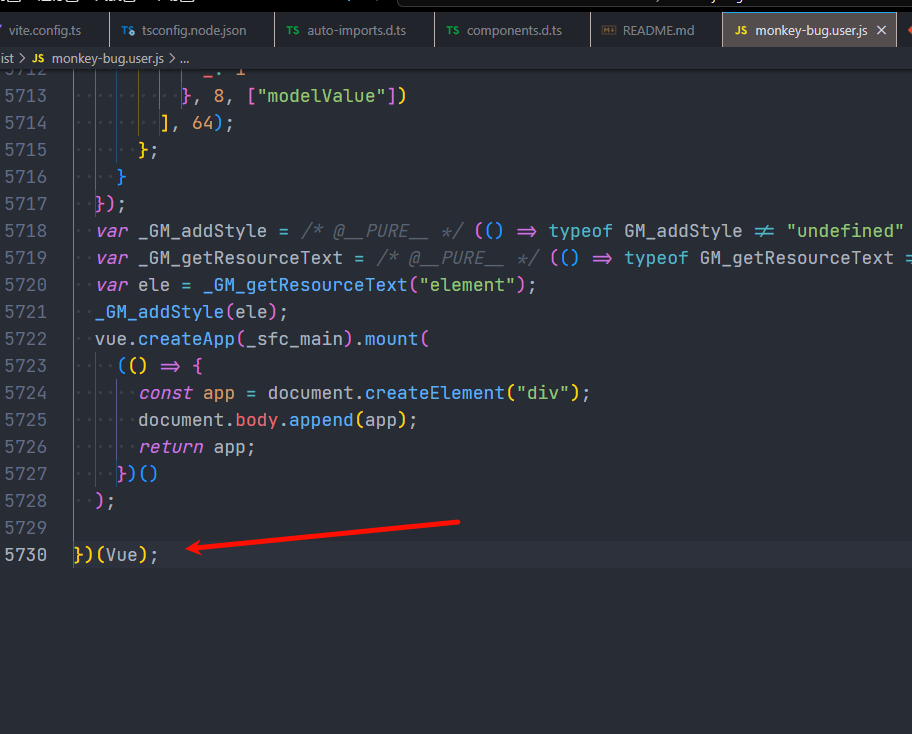

## 使用unplugin-vue-components会导致external global失效

具体操作

不使用
```
import { ElMessageBox ,ElButton,ElDialog} from 'element-plus'
```

导入(见`App.vue`)


`pnpm build`则会生成一个不带ElementPlus的`monkey-bug.user.js`,大小为`202.07 kB`,并且,这个use.js内部会添加`ElMessageBox ,ElButton,ElDialog`的代码,即elemen-plus没有使用cdn



此时,把`App.vue`里面的

```
//import { ElMessageBox ,ElButton,ElDialog} from 'element-plus'
```

注释去掉,重新打包,体积为`3.39 kB`
